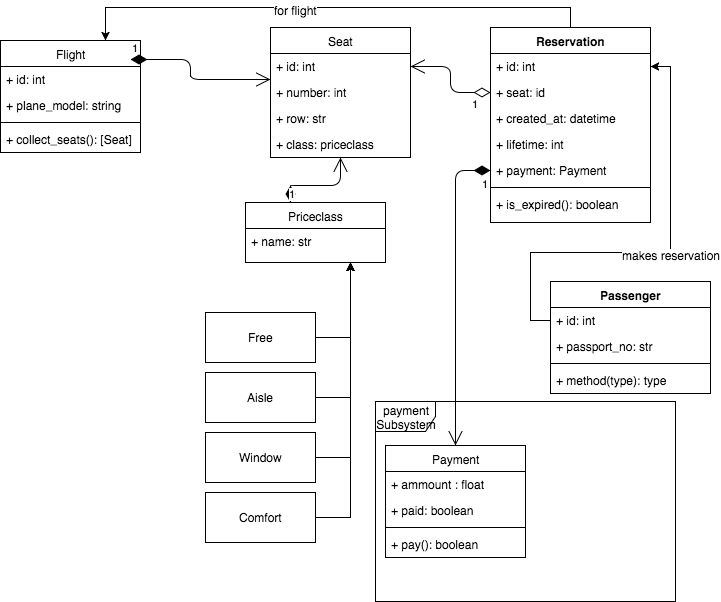
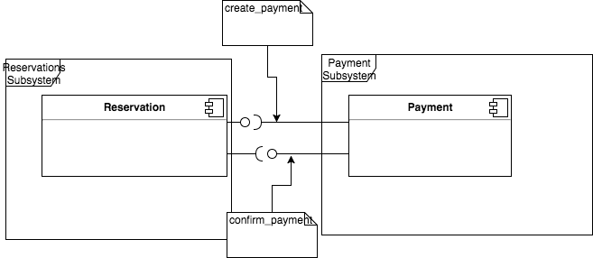

# UML Class diagram of the check-in system

The system (see class diagram) is designed to be extended easily and is kept flexible. 

The root entity is *Reservation*. It can expire, therefore we store the date of creation and the *lifetime* in seconds. With this data, we can calculate the expiration date and check if the reservation is still valid.

A reservation has - in any case - exactly one **Passenger**. It also is bound to 1 **Seat**. I cannot be bound to 0 seats because of it's lifetime behaviour. The reservations gets created at the point where the user chooses his seat. 

A seat is directly bound to a **Flight** and exists with him. The flight *manages* the available seats. If a passenger wants to make a a reservation, the flight-class collects available seats using the *collect_seats()* method and returns a list of available Seats. In the next step, the user can pick one of them or let the system pick one for him. 

A Seat has - besides it's uique, internal id, the row and numer a so called **Priceclass** which defines the fee to pay. 

Now that the passenger has chosen his or her seat, he or she has to make a **Payment**.
The user automatically created a payment ressource together with the reservation. You can see the payment as a subressource of the reservation ressource. The ammout to pay was defined by the seat selection in the previous step. Before making a payment, we should check if the reservation is still valid or if it already expired.

# Decision Notes and considerations

Payments are handled in the **Payment Subsystem**, which is separated from the check-in subsystem. This decision was made for muliple reasons. First, it's handy: Pushing the architecture to microservices, payments is a good candidate for them. It has defined, clear interfaces and a loose coupling to other components. Another reason is security. With an abstraction from the rest of the system, we are more likely to gain a higher level of security. Less coupling hardens our interfaces against data breaches.

To avoid the system from flooding in expired seats, we should consider using a *"garbage collection"* that removes expired reservations from the database. We should consider mongoDB's TTL (time to live) feature for that. See https://docs.mongodb.com/manual/tutorial/expire-data/.

# REST documentation

This section describes the REST endpoints. Note: This is not an API documentation.

## Reservations

`POST /reservation`
`DELETE /reservation/<id>`

## Flights and Seats

`GET /flights`

list all flights

`GET /flights/<id>/seats`
show all free seats for a flight

`GET /flights/<id>/seats/<row>/<number>`
show seat details like the priceclass

## Passengers

`GET /passenger/<id>`
Get passenger information for a given passenger id.

`POST /passenger`
Create Passenger information

## Payments

`GET /payments/<id>`
Show payment status

`PUT /payments/<id>`
Make a payment.

**Due to the agile development cycle, future changes to this document are possible.**